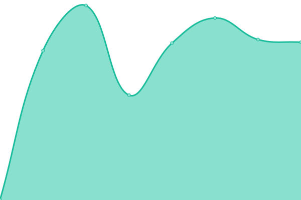
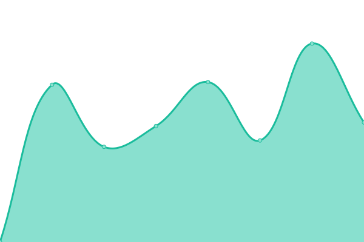
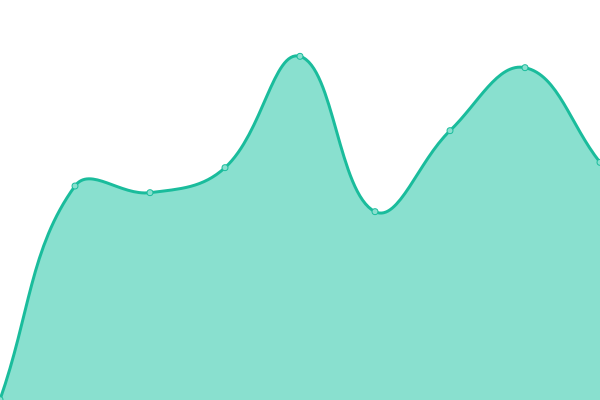
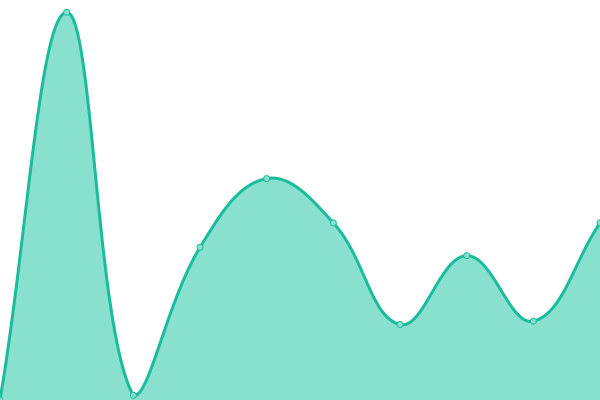
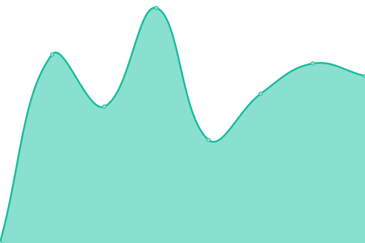

# [📈 Live Status](https://status.natureoffice.net): <!--live status--> **🟩 All systems operational**

This repository contains the open-source uptime monitor and status page for [natureOffice](https://www.natureOffice.com), powered by [Upptime](https://github.com/upptime/upptime).

With [Upptime](https://upptime.js.org), you can get your own unlimited and free uptime monitor and status page, powered entirely by a GitHub repository. We use [Issues](https://github.com/natureoffice/upptime/issues) as incident reports, [Actions](https://github.com/natureoffice/upptime/actions) as uptime monitors, and [Pages](https://status.natureoffice.net) for the status page.

<!--start: status pages-->
<!-- This summary is generated by Upptime (https://github.com/upptime/upptime) -->
<!-- Do not edit this manually, your changes will be overwritten -->
<!-- prettier-ignore -->
| URL | Status | History | Response Time | Uptime |
| --- | ------ | ------- | ------------- | ------ |
|  [natureOffice](https://natureoffice.com/) | 🟩 Up | [nature-office.yml](https://github.com/natureOffice-GmbH/upptime/commits/HEAD/history/nature-office.yml) | 

 1223ms
     
 | 

<a href="https://status.natureoffice.net/history/nature-office">100.00%</a>
    

|  [ecozoom](https://www.ecozoom.app/) | 🟩 Up | [ecozoom.yml](https://github.com/natureOffice-GmbH/upptime/commits/HEAD/history/ecozoom.yml) | 

 1293ms
     
 | 

<a href="https://status.natureoffice.net/history/ecozoom">98.25%</a>
    

|  [direct.ecozoom.app (v2)](https://direct.ecozoom.app/) | 🟩 Up | [direct-ecozoom-app-v2.yml](https://github.com/natureOffice-GmbH/upptime/commits/HEAD/history/direct-ecozoom-app-v2.yml) | 

 1436ms
     
 | 

<a href="https://status.natureoffice.net/history/direct-ecozoom-app-v2">100.00%</a>
    

|  [direct-api.ecozoom.app (v2)](https://direct-api.ecozoom.app/) | 🟩 Up | [direct-api-ecozoom-app-v2.yml](https://github.com/natureOffice-GmbH/upptime/commits/HEAD/history/direct-api-ecozoom-app-v2.yml) | 

 703ms
     
 | 

<a href="https://status.natureoffice.net/history/direct-api-ecozoom-app-v2">100.00%</a>
    

|  [natureBalance 5.x](https://www.naturebalance.net/) | 🟩 Up | [nature-balance-5-x.yml](https://github.com/natureOffice-GmbH/upptime/commits/HEAD/history/nature-balance-5-x.yml) | 

 284ms
     
 | 

<a href="https://status.natureoffice.net/history/nature-balance-5-x">100.00%</a>
    

|  [Basic](https://www.gemeinsam-ist-es-klimaschutz.de) | 🟩 Up | [basic.yml](https://github.com/natureOffice-GmbH/upptime/commits/HEAD/history/basic.yml) | 

 1190ms
     
 | 

<a href="https://status.natureoffice.net/history/basic">100.00%</a>
    

|  [nature.io (v1)](https://www.nature.io/) | 🟩 Up | [nature-io-v1.yml](https://github.com/natureOffice-GmbH/upptime/commits/HEAD/history/nature-io-v1.yml) | 

 872ms
     
 | 

<a href="https://status.natureoffice.net/history/nature-io-v1">100.00%</a>
    

|  [Logokit](https://lk.natureoffice.net/test) | 🟩 Up | [logokit.yml](https://github.com/natureOffice-GmbH/upptime/commits/HEAD/history/logokit.yml) | 

 4125ms
     
 | 

<a href="https://status.natureoffice.net/history/logokit">100.00%</a>
    

|  [Puppet](https://puppet.natureoffice.net/pdf?url=https://puppet.natureoffice.net) | 🟩 Up | [puppet.yml](https://github.com/natureOffice-GmbH/upptime/commits/HEAD/history/puppet.yml) | 

 3515ms
     
 | 

<a href="https://status.natureoffice.net/history/puppet">100.00%</a>
    

|  [klimaneutral.me (v2)](https://api-v2.klimaneutral.me) | 🟩 Up | [klimaneutral-me-v2.yml](https://github.com/natureOffice-GmbH/upptime/commits/HEAD/history/klimaneutral-me-v2.yml) | 

 496ms
     
 | 

<a href="https://status.natureoffice.net/history/klimaneutral-me-v2">100.00%</a>
    

<!--end: status pages-->

[**Visit our status website →**](https://status.natureoffice.net)

## 📄 License

- Powered by: [Upptime](https://github.com/upptime/upptime)
- Code: [MIT](./LICENSE) © [natureOffice](https://www.natureOffice.com)
- Data in the `./history` directory: [Open Database License](https://opendatacommons.org/licenses/odbl/1-0/)
